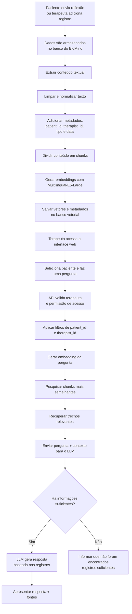
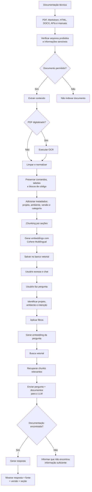

# Cenários
AULA 06 — Projeto de Arquitetura RAG
Cenário 1 — EloMind: Assistente RAG para Apoio a Terapeutas
Parte 1 — Identificação do problema
1.1 Descrição do problema
### Qual é o problema que você deseja resolver?
O problema que desejo resolver é facilitar a consulta ao histórico de acompanhamento de um paciente dentro do EloMind.
Durante o acompanhamento, podem ser armazenadas várias informações, como reflexões enviadas pelo paciente, sentimentos relatados, pontos positivos, dificuldades e feedbacks do terapeuta.
Com o passar do tempo, a quantidade de informações aumenta e o terapeuta pode ter dificuldade para encontrar rapidamente algo que foi mencionado anteriormente.
A proposta é utilizar RAG para permitir que o terapeuta faça perguntas em linguagem natural e receba respostas baseadas nos registros existentes daquele paciente.
### Quem utilizaria a aplicação?
O principal usuário seria o psicólogo ou terapeuta responsável pelo acompanhamento do paciente.
Ele poderia utilizar o sistema antes de uma sessão, durante a preparação do atendimento ou quando precisasse consultar alguma informação anterior.
Esse usuário não precisa ter conhecimento de programação, inteligência artificial ou banco de dados. A ideia é que ele apenas escreva uma pergunta normalmente e receba uma resposta.
### Que tipo de informação o usuário gostaria de consultar?
O terapeuta poderia consultar informações como:
    • reflexões enviadas pelo paciente;
    • sentimentos relatados;
    • dificuldades mencionadas;
    • aprendizados relatados;
    • pontos positivos;
    • resistências ou discordâncias;
    • feedbacks anteriores;
    • atividades sugeridas;
    • informações registradas durante o acompanhamento.
### De onde vêm essas informações?
As informações viriam principalmente dos dados armazenados no próprio EloMind.
Por exemplo:
    • reflexões cadastradas pelos pacientes;
    • feedbacks registrados pelo terapeuta;
    • anamnese;
    • registros de acompanhamento;
    • documentos adicionados pelo terapeuta;
    • materiais de apoio utilizados durante o tratamento.
### Por que utilizar um LLM sozinho não seria suficiente?
Um LLM possui conhecimento geral, mas não conhece o histórico particular de cada paciente.
Por exemplo, se o terapeuta perguntar:
"Esse paciente já falou anteriormente sobre dificuldade para dormir?"
Um LLM sozinho não saberia responder porque essa informação não fazia parte dos dados utilizados originalmente no treinamento do modelo.
Com RAG, o sistema primeiro procura essa informação nos registros daquele paciente e depois fornece os trechos encontrados ao LLM.
Assim, a resposta é baseada nos dados do EloMind e não apenas no conhecimento geral do modelo.
### Como o usuário vai utilizar o sistema?
O terapeuta utilizaria uma interface web do EloMind.
Nela existiria uma área de consulta onde seria possível selecionar um paciente e escrever uma pergunta.
Internamente, a interface faria uma chamada para uma API.
A API seria responsável por:
    1. identificar o terapeuta e o paciente;
    2. buscar as informações relevantes;
    3. enviar os trechos encontrados para o LLM;
    4. devolver a resposta para a interface.
Três perguntas reais que um usuário faria
    1. "Quais foram as principais dificuldades que este paciente relatou nas últimas semanas?"
    2. "Esse paciente já falou anteriormente sobre dificuldade para dormir?"
    3. "Quais pontos positivos esse paciente relatou desde que começou o acompanhamento?"

1.2 Por que RAG?
### Por que RAG é adequado para esse problema?
RAG é adequado porque a resposta precisa utilizar informações particulares e atualizadas sobre cada paciente.
Essas informações não fazem parte do conhecimento geral do LLM.
O RAG permite buscar os registros relacionados à pergunta e entregar somente essas informações ao modelo antes de gerar a resposta.
Dessa maneira, o sistema consegue responder baseado no histórico real disponível no EloMind.
### Que tipo de conhecimento precisa ser fornecido ao modelo?
O modelo precisaria receber principalmente informações relacionadas ao paciente consultado, como:
    • reflexões;
    • feedbacks;
    • registros da anamnese;
    • sentimentos mencionados;
    • dificuldades;
    • atividades sugeridas;
    • acontecimentos importantes registrados durante o acompanhamento.
Não é necessário enviar todo o histórico para o modelo em todas as perguntas. O objetivo do RAG é justamente localizar apenas os trechos mais relacionados à pergunta.
### Esse conhecimento muda com que frequência?
Esse conhecimento pode mudar diariamente.
Um paciente pode registrar uma nova reflexão depois de uma sessão e o terapeuta pode adicionar novos feedbacks ou informações.
Portanto, a base precisa aceitar atualizações frequentes.
### Existe necessidade de utilizar documentos privados?
Sim.
Esse é um dos pontos mais importantes do cenário.
Os registros de um paciente são privados e somente usuários autorizados devem conseguir consultá-los.
Por isso, além do RAG, o sistema precisa controlar quem pode pesquisar cada conjunto de informações.
Um terapeuta nunca deve receber na busca informações pertencentes ao paciente de outro terapeuta.
### Que problema poderia ocorrer utilizando somente o conhecimento pré-treinado?
O principal problema seria o modelo inventar uma resposta ou responder de maneira muito genérica.
Por exemplo, o terapeuta pergunta:
"Quais problemas relacionados ao sono o paciente relatou?"
Sem consultar a base, o LLM poderia responder:
"O paciente relatou dificuldade para dormir, despertares durante a noite e ansiedade antes de dormir."
Essa resposta pode parecer correta, mas pode ser totalmente falsa.
Talvez o paciente nunca tenha falado sobre esses assuntos.
Com RAG, o sistema deve responder somente utilizando registros encontrados.
Caso nenhuma informação seja localizada, uma resposta melhor seria:
"Não encontrei registros relacionados a problemas de sono no histórico consultado."

1.3 Limitações — Quando RAG não é a resposta
RAG é útil para procurar informações semânticas em textos, mas não é a melhor solução para todos os tipos de perguntas.
Busca tradicional por palavra-chave
Uma busca tradicional pode ser melhor quando o terapeuta conhece exatamente a palavra que está procurando.
Por exemplo:
"Mostre todos os registros onde aparece a palavra insônia."
Nesse caso, uma pesquisa direta pela palavra pode ser suficiente e até mais simples que utilizar RAG.
Por outro lado, se o terapeuta perguntar:
"Ele relatou algum problema para conseguir dormir?"
RAG seria interessante porque pode encontrar textos relacionados semanticamente a sono mesmo que a palavra "insônia" não tenha sido utilizada.
Banco de dados estruturado e SQL
Para informações estruturadas, SQL é mais adequado.
Por exemplo:
"Quantas reflexões este paciente enviou em agosto?"
Não faz sentido utilizar embeddings para contar registros.
Uma consulta SQL poderia fazer isso diretamente:
SELECT COUNT(*)
FROM reflections
WHERE client_id = ?
AND created_at BETWEEN ...;
Nesse caso, SQL entrega uma resposta exata.
Regras determinísticas
Algumas regras do sistema não devem depender de inteligência artificial.
Por exemplo:
    • quem pode visualizar determinado paciente;
    • quem pode excluir uma reflexão;
    • se um usuário é terapeuta ou paciente;
    • se um consentimento está ativo.
Essas situações precisam de regras programadas no sistema.
O LLM não deve decidir permissões.
Utilização direta de API
Existem informações que podem ser obtidas diretamente por uma API.
Por exemplo, se futuramente o sistema precisasse consultar a agenda do terapeuta, seria melhor consultar a API responsável pelo calendário do que tentar encontrar essa informação através de embeddings.
Combinação de SQL com RAG
Para o EloMind, provavelmente a melhor solução seria combinar diferentes técnicas.
Por exemplo, a pergunta:
"Quais assuntos apareceram com maior frequência nas últimas cinco reflexões do paciente?"
Primeiro o banco SQL poderia selecionar exatamente as cinco reflexões mais recentes.
Depois o RAG e o LLM poderiam analisar o conteúdo dessas reflexões.
Assim:
SQL
 ↓
Seleciona os registros corretos
 ↓
RAG
 ↓
Encontra conteúdo relevante
 ↓
LLM
 ↓
Gera explicação
### Existe alguma pergunta que RAG responderia mal e SQL responderia bem?
Sim.
Por exemplo:
"Quantas reflexões João enviou nos últimos 30 dias?"
RAG poderia recuperar apenas alguns registros considerados semanticamente relevantes e acabar realizando uma contagem incorreta.
O banco relacional conseguiria contar todos os registros de forma exata.
### O que acontece se precisar contar, somar ou ordenar informações espalhadas?
RAG não deve ser utilizado sozinho para esse tipo de operação.
Se a pergunta for:
"Qual paciente enviou mais reflexões neste mês?"
é melhor utilizar uma consulta SQL com COUNT, GROUP BY e ORDER BY.
Depois, se for necessário explicar o conteúdo dessas reflexões, o resultado pode ser combinado com RAG.

Parte 2 — Organização dos documentos
Tipos de informações
No cenário do EloMind poderiam existir:
    • registros vindos do banco de dados;
    • arquivos PDF;
    • arquivos DOCX;
    • Markdown;
    • textos adicionados pelo terapeuta;
    • formulários de anamnese;
    • relatórios;
    • eventualmente imagens ou documentos digitalizados.
A maior parte da informação inicialmente seria textual.
Volume aproximado
No começo poderiam existir centenas ou alguns milhares de registros.
Conforme novos terapeutas e pacientes utilizassem a plataforma, esse volume poderia chegar a dezenas ou centenas de milhares de registros.
Por isso, é importante não depender de uma busca manual em arquivos.
Tamanho típico
As reflexões normalmente seriam pequenas, contendo alguns parágrafos.
Documentos como anamnese ou relatórios poderiam possuir algumas páginas.
Materiais de apoio em PDF poderiam variar aproximadamente entre 5 e 100 páginas.
Frequência de entrada
Novas reflexões podem entrar diariamente.
Feedbacks também podem ser adicionados várias vezes durante a semana.
Já documentos de apoio provavelmente seriam atualizados com menor frequência.
Organização proposta
documentos/
├── pacientes/
│   ├── reflexoes/
│   ├── anamneses/
│   └── acompanhamentos/
│
├── terapeutas/
│   └── feedbacks/
│
├── materiais_apoio/
│   ├── artigos/
│   ├── protocolos/
│   └── orientacoes/
│
└── documentos_sistema/
    └── politicas/
Justificativa
A divisão acompanha a forma como as informações são utilizadas.
Os registros dos pacientes são separados dos materiais gerais.
Isso também facilita a criação de filtros.
Por exemplo, uma pergunta sobre um paciente poderia usar:
patient_id = 145
document_type = reflection
Dessa maneira, o sistema não pesquisaria informações de outros pacientes.
Documentos que não devem entrar
Algumas informações não devem ser indexadas automaticamente.
Por exemplo:
    • documentos sem autorização;
    • arquivos pertencentes a outro terapeuta;
    • documentos obsoletos;
    • registros excluídos;
    • arquivos temporários;
    • informações que não possuem relação com o atendimento.
Antes da ingestão existiria uma etapa de validação.
Documento
   ↓
Verificação de acesso
   ↓
Verificação da versão
   ↓
Validação
   ↓
Indexação
Controle de versões
Cada documento teria informações como:
version
created_at
updated_at
is_current
Quando uma nova versão substituísse outra, a anterior poderia continuar armazenada para histórico, mas receberia:
is_current = false
A busca normal utilizaria:
is_current = true
Assim seria reduzido o risco de recuperar conteúdo antigo.

Parte 3 — Pipeline de ingestão
O pipeline do EloMind seria:
Registros e documentos
        ↓
Extração
        ↓
Limpeza
        ↓
Metadados
        ↓
Chunking
        ↓
Embeddings
        ↓
Banco vetorial
3.1 Extração
Dados do banco
No caso das reflexões, não seria necessário utilizar OCR.
O sistema poderia obter diretamente os campos do banco:
feeling_after_session
what_learned
positive_point
resistance_or_disagreement
Esses campos poderiam ser unidos de forma organizada antes de gerar os chunks.
Exemplo:
Sentimento após a sessão:
Paciente relatou estar mais tranquilo.

Aprendizado:
Percebeu que tem dificuldade em estabelecer limites.

Ponto positivo:
Conseguiu conversar com a família.

Resistência:
Relatou dificuldade em realizar a atividade proposta.
PDF com texto selecionável
O texto seria extraído diretamente com uma biblioteca própria para PDF.
A estrutura de páginas e títulos seria preservada quando possível.
PDF digitalizado
Quando o PDF for apenas uma imagem, seria necessário OCR.
O processo seria:
PDF digitalizado
     ↓
Imagem
     ↓
OCR
     ↓
Texto
Depois seria necessário revisar a qualidade porque o OCR pode confundir letras, números e símbolos.
Tabelas
Tabelas importantes não seriam simplesmente convertidas em várias linhas desconectadas.
A relação entre coluna e valor precisa ser preservada.
Por exemplo:
Data | Sentimento | Intensidade
10/08 | Ansiedade | 8
12/08 | Tranquilidade | 5
É importante manter os cabeçalhos junto dos valores.
Imagens
Imagens apenas decorativas poderiam ser descartadas.
Porém, uma imagem que carregasse informação importante não deveria ser ignorada.
Nesse caso poderiam ser armazenados:
    • descrição da imagem;
    • texto extraído por OCR;
    • referência ao arquivo original.
Documentos multimodais
Se futuramente existissem gravações de áudio, elas poderiam ser transcritas antes da indexação.
Áudio
 ↓
Transcrição
 ↓
Texto
 ↓
Chunking
 ↓
Embedding
Problemas que podem surgir
Alguns problemas seriam:
    • PDF com texto fora de ordem;
    • OCR reconhecendo palavras incorretamente;
    • tabelas destruídas durante a extração;
    • campos vazios;
    • caracteres especiais;
    • informações duplicadas.
Por isso, a extração deveria passar por validação antes da indexação.

3.2 Limpeza e normalização
Seriam removidos elementos que não acrescentam significado, como:
    • números de página;
    • cabeçalhos repetidos;
    • rodapés repetidos;
    • espaços duplicados;
    • quebras de linha desnecessárias;
    • marcas d'água.
Também seriam padronizados:
    • codificação UTF-8;
    • espaçamento;
    • datas;
    • quebras de linha;
    • caracteres especiais.
Um cuidado importante seria não limpar demais.
Por exemplo, remover títulos como:
Sentimento após a sessão
Ponto positivo
Resistência
seria ruim porque esses títulos ajudam a entender o significado do conteúdo.

3.3 Frequência de ingestão
Para registros do EloMind, eu faria a ingestão sob demanda.
Quando uma nova reflexão fosse criada:
Nova reflexão
     ↓
Salva no banco
     ↓
Gera texto estruturado
     ↓
Chunking
     ↓
Embedding
     ↓
Banco vetorial
Não seria necessário reprocessar toda a base.
Se uma reflexão específica fosse alterada, somente os chunks daquela reflexão seriam removidos e gerados novamente.
Para identificar o documento seria utilizado document_id.

Parte 4 — Metadados
4.1 Schema do documento
{
  "document_id": "reflection_852",
  "patient_id": 145,
  "therapist_id": 21,
  "title": "Reflexão de 12/08/2026",
  "source": "elomind",
  "document_type": "reflection",
  "created_at": "2026-08-12T20:00:00",
  "updated_at": "2026-08-12T20:00:00",
  "version": 1,
  "is_current": true
}
Justificativa
document_id: identifica exatamente o registro original.
patient_id: impede misturar registros de pacientes diferentes e permite filtrar a pesquisa.
therapist_id: permite verificar se o terapeuta tem acesso ao conteúdo.
title: facilita apresentar a origem da informação.
source: informa de onde veio o conteúdo.
document_type: permite diferenciar reflexão, anamnese, feedback etc.
created_at: permite realizar filtros por período.
updated_at: ajuda a descobrir se o conteúdo mudou.
version: permite controlar alterações.
is_current: impede utilizar uma versão antiga por engano.

4.2 Schema do chunk
{
  "document_id": "reflection_852",
  "chunk_id": "reflection_852_01",
  "patient_id": 145,
  "therapist_id": 21,
  "document_type": "reflection",
  "section": "sentimento_apos_sessao",
  "created_at": "2026-08-12T20:00:00",
  "chunk_index": 1,
  "text": "O paciente relatou que..."
}
Justificativa
chunk_id: identifica individualmente cada parte.
document_id: conecta o chunk ao registro original.
patient_id: permite filtrar pelo paciente.
therapist_id: ajuda no controle de acesso.
document_type: permite limitar a pesquisa por tipo.
section: informa de qual parte da reflexão o conteúdo veio.
created_at: permite fazer perguntas por período.
chunk_index: ajuda a reconstruir a ordem original.
text: contém o conteúdo usado na recuperação.
Metadados utilizados para filtros
Principalmente:
patient_id
therapist_id
document_type
created_at
is_current
Exemplo:
"O que João relatou nas reflexões dos últimos 30 dias?"
A busca deveria obrigatoriamente filtrar:
patient_id = João
document_type = reflection
created_at >= últimos 30 dias
Metadados utilizados para citar a fonte
Na tela poderia aparecer:
Fonte: Reflexão de 12/08/2026 — seção "Sentimento após a sessão".
Para isso seriam utilizados:
title
document_id
section
created_at
Metadado caro para adicionar posteriormente
patient_id e therapist_id seriam extremamente importantes desde o início.
Se milhares de chunks fossem indexados sem esses campos, seria necessário descobrir novamente a quem pertence cada chunk e reindexar toda a base.
Além do custo, isso poderia criar um problema de segurança.
### Como extrair os metadados?
Alguns metadados viriam diretamente do banco:
patient_id
therapist_id
created_at
document_type
Outros seriam criados pelo pipeline:
chunk_id
chunk_index
section
version

Parte 5 — Chunking / Splitting
No EloMind eu não dividiria todos os registros simplesmente a cada 1.000 caracteres.
A estrutura da informação possui significado.
Uma reflexão, por exemplo, possui campos diferentes.
Por isso, eu utilizaria primeiro uma divisão semântica por campos ou seções.
Exemplo:
Reflexão
├── Sentimento após sessão
├── Aprendizado
├── Ponto positivo
└── Resistência
Se uma seção fosse muito grande, utilizaria um Recursive Character Text Splitter como segunda etapa.
Tamanho aproximado
Utilizaria inicialmente chunks entre aproximadamente 250 e 400 tokens.
A razão é que as reflexões normalmente possuem textos relativamente curtos e o objetivo é manter cada pensamento completo.
Não faria sentido transformar uma reflexão de poucas linhas em vários pedaços minúsculos.
Overlap
Utilizaria aproximadamente 40 a 60 tokens de overlap somente quando uma seção precisasse ser dividida.
Se a reflexão já couber inteira em um pequeno chunk, não existiria necessidade de overlap.
Divisão
A ordem seria:
Seções
 ↓
Parágrafos
 ↓
Sentenças
 ↓
Caracteres, se necessário
Estratégia diferente por tipo de documento
Sim.
Reflexões
Divisão por campos ou pequenos blocos semânticos.
Anamnese
Divisão por seções:
Histórico familiar
Histórico médico
Queixa principal
Rotina
Relacionamentos
Artigos ou PDFs
Divisão por:
Título
Subtítulo
Parágrafos
Portanto, uma única estratégia para todos os documentos provavelmente não seria adequada.
### O que acontece se os chunks forem muito pequenos?
O contexto pode ser perdido.
Exemplo:
Chunk 1:
Paciente disse que está preocupado.
Chunk 2:
A preocupação começou depois da mudança de emprego.
Se somente o primeiro chunk for recuperado, uma informação importante foi perdida.
### E se forem muito grandes?
Um chunk muito grande pode possuir vários assuntos diferentes.
Isso pode dificultar a busca porque o vetor passa a representar muitos temas ao mesmo tempo.
Além disso, aumenta a quantidade de texto enviada ao modelo.
### Como tratar tabelas?
Eu evitaria cortar uma tabela no meio.
Cada tabela pequena seria mantida inteira.
Se fosse muito grande, os cabeçalhos seriam repetidos nos blocos.
### Como tratar imagens?
Imagens importantes receberiam uma descrição textual ou texto extraído por OCR.
O chunk poderia guardar também um identificador da imagem original.
### Como saber se o chunking foi bom?
Eu criaria um conjunto de perguntas conhecidas.
Por exemplo:
Pergunta:
"Quando o paciente mencionou problemas para dormir?"
Depois verificaria se o chunk contendo esse registro aparece entre os primeiros resultados.
Poderíamos comparar:
chunk 150 tokens
chunk 300 tokens
chunk 500 tokens
E observar qual estratégia recupera corretamente mais respostas.
A decisão final não deveria ser baseada apenas em um número escolhido aleatoriamente.

Parte 6 — Embeddings
Modelo escolhido para o EloMind
Escolhi:
Multilingual-E5-Large
Item	Informação
Modelo	intfloat/multilingual-e5-large
Dimensão	1024
Português	Sim
Multilíngue	Sim, suporta cerca de 100 idiomas
Entrada máxima	512 tokens
Open source / pesos disponíveis	Sim
Execução local	Sim
API própria obrigatória	Não
Custo do modelo	Sem cobrança por token ao executar localmente; existe custo da infraestrutura
Fonte	Hugging Face — intfloat/multilingual-e5-large
A documentação do modelo informa dimensão de 1024, suporte a aproximadamente 100 idiomas e truncamento dos textos em no máximo 512 tokens.
### Por que esse modelo?
A principal razão é a possibilidade de executar o embedding em uma infraestrutura controlada pelo próprio sistema.
Como o EloMind possui informações privadas, evitar o envio desnecessário do conteúdo para serviços externos é uma vantagem.
Além disso, o modelo é multilíngue e atende textos em português.
Modelo alternativo
Considerei utilizar o Cohere embed-multilingual-v3.0.
Ele também possui embeddings de dimensão 1024, limite de 512 tokens e suporte multilíngue.
Porém, para este cenário, eu daria preferência inicialmente ao modelo local devido à natureza sensível dos dados.
### Documentos sigilosos mudam a escolha?
Sim.
Se os registros não fossem sensíveis, utilizar uma API poderia simplificar bastante a infraestrutura.
No EloMind eu daria preferência ao processamento local ou a uma infraestrutura privada controlada.
Tamanho máximo e chunking
Sim, existe relação direta.
Como o multilingual-e5-large trabalha com até 512 tokens, não seria adequado criar chunks de 1.000 ou 2.000 tokens, pois parte do conteúdo seria truncada.
Por isso escolhi chunks aproximadamente entre 250 e 400 tokens.

## Arquitetura final — EloMind

### Diagrama de fluxo

### Tabela de decisões

| Etapa | Decisão | Justificativa |
| --- | --- | --- |
| Extração | Banco + extração de PDF/OCR quando necessário | A maior parte dos dados já nasce digital |
| Limpeza | Remover ruído preservando títulos e campos | Os nomes dos campos carregam significado |
| Chunking | Seções + 250–400 tokens | Reflexões são pequenas e precisam manter contexto |
| Metadados | Paciente, terapeuta, tipo, data e origem | Segurança, filtro e rastreabilidade |
| Embeddings | Multilingual-E5-Large local | Português e maior controle sobre dados privados |

### Riscos e limitações
A arquitetura não elimina completamente respostas incorretas.
Um documento pode estar errado ou incompleto e o RAG poderá recuperar essa informação.
Também existe risco de o sistema não encontrar um registro relevante devido a uma pergunta muito vaga.
Outro problema é que RAG não substitui consultas SQL para cálculos e contagens.
Por fim, o assistente não deve realizar diagnóstico ou substituir a decisão do profissional. Ele deve funcionar como ferramenta para organização e recuperação da informação.

# CENÁRIO 2 — Assistente RAG para Suporte Técnico e Documentação de TI
Parte 1 — Identificação do problema
1.1 Descrição do problema
### Qual problema desejo resolver?
O problema é facilitar a consulta à documentação técnica de uma empresa.

Em muitas equipes de tecnologia, o conhecimento importante do dia a dia está espalhado em diferentes formatos, pastas, sistemas internos e repositórios. Isso significa que, mesmo quando a informação já existe, ela nem sempre é fácil de localizar no momento em que alguém precisa resolver um incidente, configurar um serviço, entender um procedimento ou tirar uma dúvida sobre a arquitetura do ambiente.

Uma equipe de tecnologia pode possuir vários documentos diferentes:
    • manuais;
    • documentação de APIs;
    • procedimentos de deploy;
    • configurações de servidores;
    • documentação de banco de dados;
    • tutoriais internos;
    • problemas já solucionados.
Além da variedade de formatos, outro problema é que a documentação pode estar organizada de forma inconsistente. Parte do conteúdo pode estar bem estruturada em Markdown, outra parte pode estar em PDFs antigos, e algumas informações podem existir apenas em anotações internas ou páginas pouco acessadas. Em um cenário assim, encontrar a resposta certa pode consumir tempo demais, especialmente em situações de urgência.

Quando alguém encontra um problema, muitas vezes precisa procurar manualmente em vários arquivos, abrir múltiplos documentos, usar buscas por palavra-chave que nem sempre funcionam bem e tentar descobrir qual conteúdo ainda está atualizado. Esse processo pode gerar retrabalho, atrasos no suporte, erros operacionais e dependência excessiva de pessoas mais experientes da equipe.

Esse tipo de dificuldade aparece em perguntas práticas do cotidiano, como:
    • qual é o procedimento correto de deploy em produção;
    • como reiniciar um serviço específico;
    • qual porta determinada API utiliza;
    • onde está descrita a configuração de um proxy;
    • como restaurar um backup;
    • qual já foi a solução adotada para um erro semelhante.

O RAG permitiria que o usuário escrevesse uma pergunta em linguagem natural e encontrasse rapidamente as partes mais relevantes da documentação disponível. Em vez de depender apenas de navegação manual ou de busca textual simples, o sistema poderia recuperar trechos semanticamente relacionados à dúvida e entregar uma resposta mais contextualizada, com base no conteúdo real da empresa.

Assim, o objetivo não é apenas “achar arquivos”, mas transformar a documentação em uma fonte de consulta mais acessível, rápida e útil para apoiar o trabalho técnico do dia a dia.
### Quem utilizaria?
Principalmente:
    • desenvolvedores;
    • técnicos de suporte;
    • DevOps;
    • profissionais de infraestrutura.
Um desenvolvedor novo na empresa poderia utilizar bastante o sistema porque ainda não conhece todos os procedimentos internos.
O usuário possuiria conhecimento técnico de TI, mas não precisaria entender de RAG ou inteligência artificial.
### Que informações gostaria de consultar?
Por exemplo:
    • como fazer deploy;
    • configuração de Docker;
    • documentação de APIs;
    • procedimentos de backup;
    • resolução de erros;
    • configuração de banco;
    • padrões utilizados pela empresa;
    • documentação de servidores.
### De onde vêm essas informações?
Poderiam vir de:
    • Markdown;
    • README;
    • PDF;
    • documentação de projetos;
    • páginas HTML;
    • arquivos DOCX;
    • documentação de APIs;
    • manuais internos.
### Por que LLM sozinho não é suficiente?
O LLM conhece Docker, Linux e programação de maneira geral.
Porém, ele não sabe como aquela empresa configurou seu servidor.
Por exemplo:
"Em qual porta o backend do projeto X está rodando?"
O modelo poderia responder com uma porta comum, como 8080, mesmo que o sistema utilize 8001.
O RAG permite consultar a documentação real antes de responder.
### Como será utilizado?
A aplicação poderia possuir uma interface web parecida com um chat.
O usuário faria a pergunta e receberia:
Resposta
+
Fonte utilizada
+
Documento
+
Seção
Três perguntas reais
    1. "Como faço o deploy do backend no servidor de produção?"
    2. "O container da API não está iniciando. Já tivemos algum problema parecido?"
    3. "Qual é o procedimento para restaurar o backup do banco de dados?"

1.2 Por que RAG?
RAG é adequado porque grande parte do conhecimento está em textos não estruturados.
Uma documentação pode dizer:
Para fazer deploy em produção execute docker compose up -d
e depois verifique os logs utilizando docker compose logs.
Essa informação é fácil para uma pessoa entender, mas não é naturalmente uma linha de uma tabela SQL.
A busca semântica consegue encontrar essa informação mesmo se a pergunta for:
"Como subo os containers no servidor?"
Conhecimento fornecido
O modelo poderia receber:
    • procedimentos internos;
    • READMEs;
    • manuais;
    • configurações;
    • documentação de APIs;
    • registros de erros conhecidos;
    • procedimentos de backup.
Frequência de atualização
A documentação poderia mudar semanalmente ou até diariamente.
Uma nova versão do sistema pode alterar:
    • porta;
    • variável de ambiente;
    • comando;
    • endpoint;
    • versão de uma biblioteca.
Portanto, os documentos precisam ser reindexados quando forem modificados.
Documentos privados
Sim.
Alguns documentos podem conter:
    • endereços internos;
    • arquitetura;
    • nomes de servidores;
    • configurações;
    • procedimentos internos.
Senhas e chaves secretas, porém, não devem ser indexadas.
Exemplo de resposta errada
Pergunta:
"Qual comando utilizamos para iniciar o projeto em produção?"
Um LLM sozinho poderia responder:
docker-compose up -d
Mas a empresa talvez utilize:
docker compose -f docker-compose.prod.yml up -d
O primeiro comando seria uma resposta possível genericamente, mas errada para aquele projeto.

1.3 Quando RAG não seria a resposta?
Busca por palavra-chave
Se eu quiser encontrar exatamente:
N8N_HOST
uma busca textual tradicional pode ser mais rápida e precisa.
SQL
Se a pergunta for:
"Quantos chamados de suporte foram abertos esta semana?"
SQL seria melhor.
Regras determinísticas
Perguntas como:
"Este usuário tem permissão para acessar produção?"
devem ser respondidas pelo sistema de permissões.
Não pelo LLM.
API
Para saber:
"O servidor está online agora?"
eu consultaria uma API de monitoramento.
Uma documentação RAG pode dizer como o servidor deveria funcionar, mas não consegue garantir o estado atual dele.
Combinação
Uma solução mais completa poderia utilizar:
RAG → documentação
SQL → dados estruturados
API → estado atual
Regras → permissões
Pergunta ruim para RAG
"Quantos incidentes tivemos em julho?"
Se os incidentes estiverem em uma tabela, SQL seria muito mais seguro.
Contar ou ordenar documentos
RAG pode recuperar apenas uma parte dos documentos.
Por isso, pedir para contar todos os documentos recuperados semanticamente pode gerar erro.
Uma consulta estruturada deveria fazer a contagem primeiro.

Parte 2 — Organização dos documentos
Tipos de arquivos
Poderiam existir:
    • Markdown;
    • PDF;
    • HTML;
    • DOCX;
    • TXT;
    • YAML;
    • documentação de API;
    • trechos controlados de logs.
Volume
Inicialmente:
centenas de documentos.
Em uma empresa maior, facilmente poderiam existir milhares.
Tamanho
READMEs podem possuir poucas páginas.
Manuais poderiam possuir entre 20 e 200 páginas.
Documentação de APIs pode ser muito maior.
Atualização
Documentos técnicos podem mudar semanalmente ou sempre que ocorre uma nova versão.
Estrutura
documentos/
├── desenvolvimento/
│   ├── backend/
│   ├── frontend/
│   └── mobile/
│
├── infraestrutura/
│   ├── docker/
│   ├── servidores/
│   ├── proxy/
│   └── backups/
│
├── banco_dados/
│
├── APIs/
│
├── troubleshooting/
│
└── manuais/
Justificativa
Essa divisão segue a forma como a equipe de tecnologia procura informações.
Um desenvolvedor normalmente pensa:
"Meu problema é backend?"
"É Docker?"
"É banco?"
"É servidor?"
Além disso, as categorias poderiam se tornar filtros da pesquisa.

Documentos que não entram
Eu impediria a indexação de:
    • .env;
    • senhas;
    • tokens;
    • API keys;
    • certificados privados;
    • arquivos temporários;
    • documentação obsoleta.
O pipeline poderia possuir uma lista de arquivos proibidos:
.env
.env.*
*.pem
*.key
secrets.*
Além disso, poderia procurar padrões suspeitos antes da ingestão.

Versionamento
Os documentos teriam:
{
  "version": "2.3",
  "updated_at": "2026-08-14",
  "is_current": true
}
Quando uma nova versão fosse publicada, a antiga seria marcada:
is_current = false
A busca normal utilizaria somente documentos atuais.

Parte 3 — Pipeline de ingestão
Documentos
 ↓
Extração
 ↓
Limpeza
 ↓
Metadados
 ↓
Chunking
 ↓
Embeddings
 ↓
Banco vetorial
3.1 Extração
Markdown
É um formato muito bom porque títulos e seções já estão definidos.
Eu preservaria:
# Deploy
## Docker
## Produção
PDF selecionável
Texto extraído diretamente preservando página e títulos.
PDF digitalizado
Aplicaria OCR.
HTML
Removeria:
    • menus;
    • propaganda;
    • scripts;
    • rodapés;
    • elementos de navegação.
Manteria o conteúdo principal.
Tabelas
Tabelas de configuração precisam ser preservadas.
Exemplo:
Ambiente | Porta | Serviço
produção | 8001  | backend
produção | 3000  | frontend
Cortar isso incorretamente poderia alterar completamente o significado.
Imagens
Diagramas de arquitetura importantes deveriam receber uma descrição ou processamento multimodal.
Imagens decorativas seriam descartadas.
Multimodal
Um vídeo de treinamento poderia passar por:
Vídeo
 ↓
Extração do áudio
 ↓
Transcrição
 ↓
Separação por tempo
 ↓
Chunks
Também armazenaria o tempo:
00:12:35
Assim a resposta poderia indicar o trecho do vídeo.

3.2 Limpeza
Removeria:
    • menus;
    • rodapés;
    • headers repetidos;
    • caracteres estranhos;
    • páginas vazias;
    • duplicações.
Manteria:
    • comandos;
    • nomes de funções;
    • caminhos;
    • endpoints;
    • versões;
    • blocos de código.
Por exemplo:
docker compose up -d
não poderia ser alterado.
Uma limpeza muito agressiva poderia remover exatamente a informação técnica necessária.

3.3 Frequência de ingestão
Para documentação ligada a repositórios, o pipeline poderia rodar quando o documento fosse alterado.
Por exemplo:
README modificado
      ↓
Detecta alteração
      ↓
Remove chunks antigos
      ↓
Processa arquivo novo
      ↓
Cria embeddings
Uma segunda opção seria executar uma sincronização diária.
Não reprocessaria a base inteira.
Utilizaria:
document_id
updated_at
hash
Se o hash mudou, o arquivo precisa ser reprocessado.

Parte 4 — Metadados
Documento
{
  "document_id": "deploy-backend-001",
  "title": "Deploy Backend Produção",
  "source": "github",
  "project": "backend-api",
  "document_type": "manual",
  "environment": "production",
  "version": "2.1",
  "created_at": "2026-06-01",
  "updated_at": "2026-08-12",
  "category": "deploy",
  "is_current": true
}
Justificativa
document_id: identificar documento.
title: mostrar a origem.
source: saber se veio de GitHub, manual etc.
project: impedir misturar projetos.
document_type: filtrar manual, API ou troubleshooting.
environment: extremamente importante para diferenciar produção e desenvolvimento.
version: evitar instruções antigas.
updated_at: identificar atualização.
category: melhorar filtros.
is_current: impedir recuperação de versões obsoletas.
Chunk
{
  "document_id": "deploy-backend-001",
  "chunk_id": "deploy-backend-001-05",
  "project": "backend-api",
  "environment": "production",
  "section": "Subindo containers",
  "document_type": "manual",
  "version": "2.1",
  "chunk_index": 5,
  "text": "Execute docker compose..."
}
Filtros
Exemplo:
"Como faço deploy do backend em produção?"
Filtros:
project = backend-api
environment = production
is_current = true
Isso evita recuperar instruções de desenvolvimento.
Citação
Na tela:
Fonte: Deploy Backend Produção — versão 2.1 — seção "Subindo containers".
Metadado caro de adicionar depois
project e environment.
Se os chunks fossem criados sem essas informações, poderia ser difícil descobrir depois se determinado comando é de produção ou desenvolvimento.
A base poderia precisar ser completamente reindexada.
Extração
Parte viria:
    • do caminho do arquivo;
    • do Git;
    • do cabeçalho do documento;
    • de metadados cadastrados;
    • do próprio pipeline.

Parte 5 — Chunking
Aqui eu utilizaria uma estratégia diferente do EloMind.
Documentação técnica normalmente possui:
Título
Subtítulo
Explicação
Código
Explicação
Eu dividiria primeiro pelos títulos Markdown ou seções.
Depois utilizaria um splitter recursivo.
Tamanho
Inicialmente utilizaria aproximadamente:
400 a 500 tokens.
Isso é maior que no EloMind porque uma instrução técnica frequentemente precisa manter explicação + comando + contexto juntos.
Overlap
Utilizaria aproximadamente:
50 tokens.
O overlap ajudaria principalmente quando um procedimento passa de uma seção para outra.
Código
Blocos pequenos de código deveriam permanecer inteiros.
Não faria sentido produzir:
Chunk 1:
docker compose
Chunk 2:
up -d
O comando precisa ser preservado.
Tabelas
Tabelas pequenas seriam mantidas inteiras.
Nas grandes, eu repetiria os cabeçalhos.
### Como validar?
Criaria uma coleção de perguntas de teste.
Por exemplo:
Como subir o backend?
Qual porta a API usa?
Como restaurar backup?
Como reiniciar o serviço?
Depois verificaria se a documentação correta aparece no top 3 ou top 5 resultados.
Também testaria perguntas escritas de formas diferentes.

Parte 6 — Embeddings
Modelo escolhido
Para esse cenário escolhi:
Cohere embed-multilingual-v3.0
Item	Informação
Modelo	embed-multilingual-v3.0
Dimensão	1024
Português	Sim
Multilíngue	Sim
Entrada máxima	512 tokens
Open source	Não como modelo comum de pesos abertos para execução livre
Execução local	Não da mesma maneira que o E5; implantação privada depende da oferta comercial
API	Sim
Custo	API possui modalidade de avaliação e produção; o valor depende do plano vigente
Fonte	Documentação oficial da Cohere
A documentação oficial informa que embed-multilingual-v3.0 produz vetores de 1024 dimensões, possui contexto de 512 tokens e suporta mais de 100 idiomas.
A própria documentação da Cohere também informa que existem chaves de avaliação gratuitas com limitações e chaves de produção.
### Por que esse modelo?
A documentação técnica pode misturar português e inglês.
Isso acontece frequentemente com termos como:
deploy
container
endpoint
request
backup
database
build
Um modelo multilíngue é interessante porque consegue trabalhar com documentos e perguntas contendo esses dois idiomas.
Além disso, utilizar uma API simplifica a infraestrutura do cenário.
Alternativa descartada
Poderia utilizar também multilingual-e5-large.
Ele seria uma boa opção caso a empresa quisesse executar tudo internamente.
Neste cenário escolhi Cohere para mostrar uma arquitetura diferente da utilizada no EloMind.
### Sigilo muda a decisão?
Sim.
Se a documentação possuir informações extremamente confidenciais, eu reconsideraria utilizar API externa e poderia migrar para um modelo local.
Independentemente disso, segredos como senhas e tokens não deveriam entrar no RAG.
Relação entre limite e chunk
O modelo trabalha com até 512 tokens de entrada.
Por isso escolhi chunks entre aproximadamente 400 e 500 tokens.
Um chunk maior poderia ser truncado.

## Arquitetura final — Suporte Técnico

### Diagrama de fluxo

### Tabela de decisões

| Etapa | Decisão | Justificativa |
| --- | --- | --- |
| Extração | Extrair Markdown, HTML, PDF e OCR | Documentação possui formatos diferentes |
| Limpeza | Remover ruído mantendo código | Código e comandos possuem significado |
| Chunking | Seção + 400–500 tokens | Procedimentos precisam manter contexto |
| Metadados | Projeto, ambiente, versão, categoria | Evita misturar sistemas e versões |
| Embeddings | Cohere multilingual | Documentação mistura português e inglês |

### Riscos e limitações
A documentação pode estar desatualizada.
O sistema também pode encontrar um documento semanticamente parecido, mas pertencente a outro projeto.
Por isso os metadados e filtros são importantes.
Outra limitação é que RAG consulta conhecimento armazenado.
Ele não necessariamente sabe o estado atual de um servidor.
Para responder:
"A API está funcionando agora?"
seria necessária uma ferramenta de monitoramento ou API externa.

Comparação entre os dois cenários
Os dois projetos utilizam RAG, mas possuem necessidades diferentes.
Característica	EloMind	Suporte Técnico
Usuário	Terapeuta	Desenvolvedor / suporte
Conteúdo	Histórico de pacientes	Documentação técnica
Privacidade	Muito alta	Alta, dependendo do documento
Atualização	Reflexões frequentes	Alterações de documentação
Chunking	250–400 tokens	400–500 tokens
Divisão principal	Campos e seções clínicas	Seções técnicas
Embedding	Multilingual-E5-Large	Cohere multilingual
Execução	Preferência local	API
Filtro crítico	patient_id / therapist_id	project / environment
SQL	Dados estruturados do paciente	Chamados e métricas
RAG	Conteúdo textual do histórico	Manuais e procedimentos
### Em que pontos as decisões foram diferentes?
Uma diferença importante foi o modelo de embedding.
No EloMind preferi um modelo executado localmente porque os registros possuem maior sensibilidade.
No suporte técnico utilizei uma API porque a simplicidade operacional pode ser mais importante, desde que documentos confidenciais sejam tratados corretamente.
O chunking também é diferente.
No EloMind as reflexões são curtas.
Por isso utilizei chunks menores.
Na documentação técnica, um procedimento pode ter uma explicação e vários comandos relacionados. Por isso os chunks são um pouco maiores.
### Em que foram iguais?
Os dois utilizam:
    • limpeza;
    • metadados;
    • controle de versões;
    • chunking;
    • embeddings;
    • banco vetorial;
    • recuperação;
    • LLM;
    • citação das fontes.
Isso não significa simplesmente repetir a arquitetura.
São etapas básicas de um pipeline RAG.
A diferença está na forma como cada etapa foi adaptada ao problema.
### Se tivesse que construir apenas um, qual escolheria?
Eu escolheria inicialmente o EloMind, porque é um cenário em que já existe uma aplicação concreta e o RAG poderia adicionar uma funcionalidade útil ao sistema.
Além disso, seria possível aproveitar os registros já existentes, como reflexões e feedbacks.
O projeto também permitiria estudar problemas importantes como:
    • segurança;
    • privacidade;
    • filtragem por usuário;
    • RAG;
    • banco relacional;
    • banco vetorial;
    • LLM.

Visão geral das duas arquiteturas
              ELOMIND

Paciente
   ↓
Reflexões / Anamnese / Feedback
   ↓
Banco EloMind
   ↓
Extração
   ↓
Limpeza
   ↓
Metadados
   ↓
Chunking
   ↓
E5 Multilingual
   ↓
Banco Vetorial
   ↑
Pergunta do Terapeuta
   ↓
Filtro por paciente
   ↓
Busca
   ↓
LLM
   ↓
Resposta + Fonte
          SUPORTE TÉCNICO

Documentação
   ↓
PDF / MD / HTML / DOCX
   ↓
Extração / OCR
   ↓
Limpeza
   ↓
Metadados
   ↓
Chunking
   ↓
Cohere Embed
   ↓
Banco Vetorial
   ↑
Pergunta do Técnico
   ↓
Filtro projeto/ambiente
   ↓
Busca
   ↓
LLM
   ↓
Resposta + Fonte

Riscos gerais
RAG reduz alguns problemas, mas não garante que toda resposta será correta.
Alguns riscos são:
    • recuperação do documento errado;
    • documento desatualizado;
    • informação ausente;
    • chunking ruim;
    • erro de OCR;
    • resposta incorreta do LLM;
    • acesso indevido a documentos;
    • dados confidenciais indexados por engano.
Por isso, um sistema real deve possuir controle de acesso, logs, versionamento e indicação das fontes utilizadas.

Como utilizei IA nesta atividade
Utilizei inteligência artificial como ferramenta de apoio para organizar as ideias, comparar alternativas e entender melhor as decisões de uma arquitetura RAG.
A IA foi utilizada principalmente para ajudar na estruturação das etapas de:
    • ingestão;
    • extração;
    • chunking;
    • metadados;
    • embeddings;
    • banco vetorial;
    • comparação entre RAG, SQL e outras alternativas.
Não considerei automaticamente todas as respostas da IA como verdadeiras.
As informações técnicas relacionadas aos modelos de embeddings foram verificadas nas páginas de documentação dos próprios modelos.
Também procurei relacionar as decisões aos dois cenários escolhidos, em vez de utilizar apenas configurações genéricas.

Referências
Multilingual-E5-Large
Hugging Face — intfloat/multilingual-e5-large
https://huggingface.co/intfloat/multilingual-e5-large
Documentação consultada para verificar:
    • dimensão do embedding;
    • idiomas;
    • tamanho máximo de entrada;
    • possibilidade de execução do modelo.
Cohere Embed
Cohere — Embed Models
https://docs.cohere.com/docs/cohere-embed
Cohere — Models
https://docs.cohere.com/docs/models
Cohere — FAQ
https://docs.cohere.com/docs/cohere-faqs
Documentação consultada para verificar:
    • dimensão;
    • contexto máximo;
    • suporte multilíngue;
    • disponibilidade através da API;
    • modalidades de acesso.
Mermaid
https://mermaid.js.org/
Utilizado para representar os diagramas de fluxo em um formato mais compatível com Markdown.

Conclusão
Os dois cenários mostram que uma arquitetura RAG não deve ser criada apenas escolhendo um tamanho de chunk e um modelo de embedding.
Cada decisão depende do problema.
No EloMind, segurança, privacidade e isolamento entre pacientes são pontos centrais.
No suporte técnico, os principais desafios são versionamento, diferentes formatos de documentação, presença de código e separação entre projetos e ambientes.
Nos dois casos, RAG funciona melhor como parte de uma arquitetura maior.
Ele não substitui SQL, APIs ou regras do sistema.
A melhor solução é utilizar cada tecnologia para o problema que ela consegue resolver melhor.
