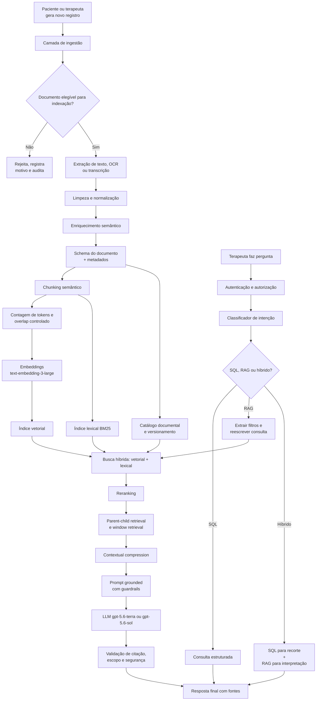
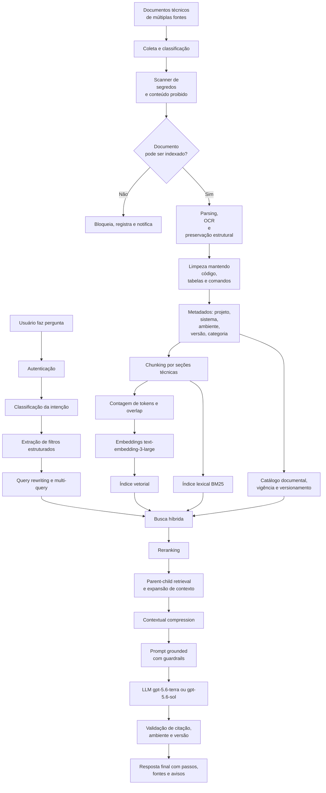

# Cenários

## AULA 06 - Projeto de Arquitetura RAG

Este documento foi refatorado para apresentar uma arquitetura RAG mais madura, com foco em:

- organização por `documentos`, `chunks`, metadados e `schemas`;
- escolha explícita de LLM, embeddings e orçamento de tokens;
- técnicas modernas de RAG, combinando recuperação lexical, vetorial e reranking;
- guardrails de segurança, privacidade, grounding e conformidade;
- diagramas mais robustos, coesos e coerentes;
- separação clara entre perguntas que devem ir para SQL, regras determinísticas, APIs ou RAG.

---

## 1. Diretrizes arquiteturais comuns aos dois cenários

Antes dos cenários, é importante definir uma base conceitual comum. Em ambos os casos, RAG não será tratado como "buscar texto e mandar para o LLM", mas como um pipeline completo de ingestão, indexação, recuperação, filtragem, reranking, geração, citação e observabilidade.

### 1.1 Objetivo do RAG

O objetivo principal é permitir respostas:

- ancoradas em fontes reais da organização;
- auditáveis;
- atualizadas com alta frequência;
- restritas ao escopo correto de acesso;
- com baixa taxa de alucinação;
- capazes de citar de onde veio cada afirmação.

### 1.2 Técnicas de RAG recomendadas

Sempre que possível, a arquitetura deve combinar a maior parte das técnicas abaixo:

- ingestão incremental;
- deduplicação de documentos e chunks;
- versionamento de documentos;
- chunking semântico orientado à estrutura;
- overlap controlado;
- embeddings com metadados ricos;
- busca vetorial;
- busca lexical ou BM25;
- busca híbrida;
- filtros por metadados;
- `top-k` inicial amplo;
- reranking dos resultados;
- contextual compression;
- parent-child retrieval;
- recuperação por janelas ou vizinhança de chunks;
- query rewriting;
- multi-query retrieval;
- self-query para extrair filtros estruturados;
- threshold mínimo de similaridade ou score;
- fallback para SQL ou API quando a pergunta não for de RAG;
- geração com citação de fontes;
- resposta com abstenção explícita quando não houver evidência suficiente;
- avaliação offline com conjunto de perguntas conhecidas;
- observabilidade com logs de recuperação, latência, custo e qualidade.

### 1.3 Escolha recomendada de stack de modelos

Para esta refatoração, a recomendação principal será baseada em uma stack atual de OpenAI para RAG.

#### LLM principal

Recomendação principal:

- `gpt-5.6-terra` como modelo padrão de produção, por equilibrar inteligência, custo e janela de contexto.

Recomendações complementares:

- `gpt-5.6-sol` para consultas mais complexas, sínteses longas, análises clínicas delicadas e raciocínio avançado;
- `gpt-5.6-luna` para tarefas de alto volume e menor custo, como classificação, normalização, extração leve e algumas etapas auxiliares do pipeline.

#### Embeddings

Recomendação principal:

- `text-embedding-3-large` como embedding padrão de maior qualidade.

Alternativa de custo menor:

- `text-embedding-3-small`.

#### Tokens e contexto

Recomendação arquitetural:

- usar chunks médios entre 250 e 600 tokens, dependendo do tipo documental;
- limitar o contexto final enviado ao LLM com orçamento explícito;
- contar tokens ainda no pipeline de ingestão e antes da geração;
- preferir reranking + compressão contextual em vez de simplesmente enviar muitos chunks.

#### Observação importante

A afirmação de que esses são os "melhores" modelos é uma recomendação para este tipo de arquitetura e para este documento. Ela é uma inferência de projeto baseada na documentação oficial atual dos modelos, custos, contexto e embeddings, e não uma verdade universal para qualquer orçamento ou requisito.

### 1.4 Fontes oficiais consultadas para a escolha de modelos

- OpenAI Models: https://developers.openai.com/api/docs/models
- OpenAI Model selection: https://developers.openai.com/api/docs/guides/model-selection
- OpenAI Embeddings: https://developers.openai.com/api/docs/guides/embeddings
- OpenAI Token counting: https://developers.openai.com/api/docs/guides/token-counting
- OpenAI Vector store search: https://developers.openai.com/api/reference/vector-stores/search
- OpenAI Moderation: https://developers.openai.com/api/docs/models/omni-moderation-latest

### 1.5 Dados oficiais relevantes para esta proposta

Com base na documentação oficial atual:

- `gpt-5.6-sol`, `gpt-5.6-terra` e `gpt-5.6-luna` possuem janela de contexto de 1.05M tokens e saída máxima de 128K tokens;
- `gpt-5.6-sol` é posicionado pela OpenAI como flagship para raciocínio complexo;
- `text-embedding-3-large` é o embedding mais capaz da família, com dimensão padrão de 3072;
- `text-embedding-3-small` possui dimensão padrão de 1536;
- o endpoint de embeddings aceita entradas de até 8192 tokens;
- a API permite redução de dimensionalidade via parâmetro `dimensions`;
- a busca em vector store suporta filtros por atributos, `rewrite_query` e opções de ranking;
- `omni-moderation` é o modelo de moderação mais capaz da OpenAI para texto e imagem.

---

## 2. Guardrails comuns aos dois cenários

RAG não deve ser apenas correto tecnicamente. Ele também precisa ser seguro. Por isso, a arquitetura deve incorporar guardrails em múltiplas camadas.

### 2.1 Guardrails de acesso

- autenticação obrigatória;
- autorização antes da busca;
- filtragem por escopo antes de qualquer recuperação vetorial;
- proibição de recuperação cruzada entre tenants, pacientes, projetos ou ambientes;
- negação por padrão quando o escopo não estiver claro.

### 2.2 Guardrails de dados

- documentos sigilosos só entram no índice quando houver autorização;
- documentos excluídos, expirados ou obsoletos devem ser removidos ou marcados como inativos;
- segredos, tokens, senhas, chaves privadas e credenciais não devem ser indexados;
- PII sensível deve ser minimizada, mascarada ou segregada quando possível;
- o índice vetorial deve carregar apenas o texto necessário para recuperação.

### 2.3 Guardrails de grounding

- o modelo deve responder apenas com base no contexto recuperado;
- cada resposta deve citar as fontes relevantes;
- se não houver evidência suficiente, a resposta deve declarar insuficiência de base documental;
- o prompt deve proibir inferência clínica, jurídica ou operacional sem lastro nas fontes;
- fatos estruturados devem ser buscados via SQL ou API, não inferidos pelo LLM.

### 2.4 Guardrails de segurança de prompt

- sanitização de entrada do usuário;
- isolamento entre instruções de sistema e conteúdo recuperado;
- tratamento do conteúdo recuperado como dado, não como instrução;
- defesa contra prompt injection em documentos indexados;
- rejeição de tentativas de extração de dados fora do escopo permitido.

### 2.5 Guardrails de saída

- moderação de entrada e saída quando o domínio exigir;
- validação de formato com `JSON schema` para respostas estruturadas;
- checagem de presença de citações;
- pós-processamento para mascarar dados sensíveis na resposta final;
- bloqueio de ações automatizadas quando a confiança ou a evidência forem insuficientes.

### 2.6 Guardrails de observabilidade e governança

- logar consulta, filtros aplicados, chunks recuperados, chunks reranqueados e fontes finais;
- armazenar versão do prompt, versão do índice e versão do modelo;
- medir taxa de abstenção, taxa de citação, latência, custo e precisão por cenário;
- criar conjunto de avaliação contínua;
- permitir auditoria posterior da resposta gerada.

---

# CENÁRIO 1 - EloMind: Assistente RAG para apoio a terapeutas

## 3. Identificação do problema

### 3.1 Problema a resolver

O EloMind precisa facilitar a consulta ao histórico clínico e terapêutico de um paciente sem obrigar o terapeuta a reler manualmente todo o acompanhamento. Ao longo do tratamento, acumulam-se reflexões, anamnese, feedbacks, planos, registros de sessão, documentos anexos e materiais complementares. O valor do sistema está em recuperar rapidamente o que é relevante para uma pergunta real.

Exemplos de perguntas:

1. Quais dificuldades este paciente relatou nas últimas quatro semanas?
2. O paciente já mencionou problemas de sono anteriormente?
3. Quais progressos o paciente apresentou desde o início do acompanhamento?
4. Em quais registros apareceram sinais de resistência às atividades propostas?

### 3.2 Usuário principal

O usuário principal é o terapeuta ou psicólogo responsável pelo acompanhamento. Esse usuário não precisa entender IA, RAG ou bancos vetoriais. A experiência deve ser a de uma busca conversacional segura, explicável e com citação de fontes.

### 3.3 Por que um LLM sozinho não basta

Um LLM conhece psicologia de forma geral, mas não conhece o histórico particular do paciente. Sem recuperação, ele pode produzir respostas plausíveis e erradas. Neste cenário, isso é especialmente grave porque:

- o dado é privado;
- o histórico muda frequentemente;
- a resposta precisa ser rastreável;
- uma alucinação pode induzir o profissional ao erro.

### 3.4 Por que RAG é adequado

RAG é adequado porque:

- o conhecimento é privado e específico por paciente;
- a base é atualizada continuamente;
- o usuário precisa de linguagem natural;
- a resposta deve ser fundamentada em registros reais;
- existe forte dependência de filtragem por escopo.

### 3.5 Onde RAG não é a melhor resposta

RAG não deve ser usado sozinho para:

- contagens exatas;
- somatórios;
- ordenações completas;
- regras de autorização;
- cálculo de indicadores;
- verificação de consentimento;
- ações transacionais.

Nesses casos:

- SQL resolve dados estruturados;
- regras determinísticas resolvem permissões;
- APIs resolvem integrações operacionais.

Exemplo:

- "Quantas reflexões o paciente enviou em agosto?" deve ir para SQL.
- "Quem pode visualizar este prontuário?" deve ser decidido por regra de autorização.
- "Qual foi o tema predominante nas cinco reflexões mais recentes?" pode usar SQL para selecionar as cinco reflexões e RAG para interpretar o conteúdo.

---

## 4. Organização documental do EloMind

### 4.1 Tipos de fonte

As fontes podem incluir:

- reflexões do paciente;
- feedbacks do terapeuta;
- anamnese;
- registros de acompanhamento;
- planos terapêuticos;
- documentos anexados;
- materiais de apoio;
- áudios transcritos;
- PDFs com texto ou OCR;
- formulários estruturados.

### 4.2 Organização lógica recomendada

```text
dados_elomind/
├── pacientes/
│   ├── reflexoes/
│   ├── anamneses/
│   ├── sessoes/
│   ├── planos_terapeuticos/
│   └── anexos/
├── terapeutas/
│   └── feedbacks/
├── materiais_apoio/
│   ├── protocolos/
│   ├── artigos/
│   └── orientacoes/
└── governanca/
    ├── consentimentos/
    ├── politicas/
    └── auditoria/
```

### 4.3 Regras de inclusão no índice

Só devem entrar no índice:

- documentos ativos;
- documentos autorizados;
- versões vigentes ou explicitamente históricas com marcação clara;
- documentos pertencentes ao paciente correto;
- conteúdos já validados pelo pipeline.

Não devem entrar:

- registros excluídos;
- rascunhos não autorizados;
- documentos de outro terapeuta fora do escopo;
- anexos sem relação com o atendimento;
- arquivos temporários;
- conteúdo com falha crítica de extração.

---

## 5. Pipeline de ingestão do EloMind

### 5.1 Etapas

Pipeline proposto:

1. captura do documento ou evento;
2. validação de acesso e elegibilidade;
3. extração de conteúdo;
4. limpeza e normalização;
5. enriquecimento semântico;
6. geração de metadados;
7. chunking semântico;
8. geração de embeddings;
9. indexação vetorial e lexical;
10. versionamento;
11. avaliação e observabilidade.

### 5.2 Extração

#### Banco relacional

Campos estruturados podem ser transformados em texto canônico antes do chunking.

Exemplo:

```text
Sentimento após a sessão:
Paciente relatou estar mais tranquilo e com menos ansiedade.

Aprendizado:
Percebeu dificuldade em estabelecer limites no ambiente familiar.

Ponto positivo:
Conseguiu conversar com a irmã sobre um conflito recorrente.

Resistência:
Relatou dificuldade em realizar a atividade proposta entre sessões.
```

#### PDFs e anexos

- PDFs textuais: extração direta;
- PDFs digitalizados: OCR;
- imagens relevantes: OCR + descrição textual;
- áudios: transcrição antes da indexação.

### 5.3 Limpeza e normalização

Devem ser removidos:

- cabeçalhos repetidos;
- rodapés repetidos;
- numeração de página;
- quebras artificiais;
- ruído visual;
- caracteres inválidos.

Devem ser preservados:

- títulos clínicos;
- nomes de seção;
- cronologia;
- autoria;
- marca temporal;
- relações entre pergunta, resposta e comentário.

### 5.4 Enriquecimento semântico

Antes de gerar chunks, o pipeline pode enriquecer o documento com campos padronizados:

- tipo de registro;
- seção clínica;
- marcador temporal;
- autor do registro;
- idioma;
- status do documento;
- nível de sensibilidade;
- origem do conteúdo;
- indicador de consentimento.

### 5.5 Frequência de ingestão

Recomendação:

- ingestão incremental quase em tempo real para novos registros;
- reprocessamento apenas do documento alterado;
- remoção lógica ou física de chunks quando o documento for revogado;
- fila assíncrona para OCR, transcrição e embeddings.

---

## 6. Schemas e metadados do EloMind

### 6.1 Schema do documento

```json
{
  "document_id": "reflection_852",
  "tenant_id": "clinic_01",
  "patient_id": "patient_145",
  "therapist_id": "therapist_21",
  "session_id": "session_302",
  "source_system": "elomind",
  "document_type": "reflection",
  "title": "Reflexão pós-sessão de 2026-08-12",
  "language": "pt-BR",
  "sensitivity_level": "clinical_restricted",
  "consent_status": "active",
  "created_at": "2026-08-12T20:00:00Z",
  "updated_at": "2026-08-12T20:00:00Z",
  "event_date": "2026-08-12",
  "version": 3,
  "is_current": true,
  "is_deleted": false,
  "checksum_sha256": "abc123",
  "source_uri": "elomind://patients/145/reflections/852"
}
```

### 6.2 Schema do chunk

```json
{
  "chunk_id": "reflection_852_chunk_0003",
  "document_id": "reflection_852",
  "parent_document_id": "reflection_852",
  "tenant_id": "clinic_01",
  "patient_id": "patient_145",
  "therapist_id": "therapist_21",
  "document_type": "reflection",
  "section": "resistencia",
  "chunk_index": 3,
  "token_count": 286,
  "char_count": 1418,
  "language": "pt-BR",
  "embedding_model": "text-embedding-3-large",
  "embedding_dimensions": 1024,
  "is_current": true,
  "created_at": "2026-08-12T20:00:00Z",
  "event_date": "2026-08-12",
  "window_prev": "reflection_852_chunk_0002",
  "window_next": "reflection_852_chunk_0004",
  "lexical_terms": ["resistência", "atividade proposta", "dificuldade"],
  "text": "Paciente relatou dificuldade em realizar a atividade proposta..."
}
```

### 6.3 Por que esses metadados importam

- `tenant_id`: separa clínicas ou organizações;
- `patient_id`: evita mistura entre pacientes;
- `therapist_id`: ajuda na autorização;
- `document_type`: permite filtros por reflexão, anamnese, feedback etc.;
- `section`: melhora busca e explicabilidade;
- `event_date`: importante para perguntas temporais;
- `version` e `is_current`: evitam citar documento vencido;
- `token_count`: ajuda no orçamento de contexto;
- `window_prev` e `window_next`: permitem recuperar vizinhança;
- `sensitivity_level`: reforça proteção;
- `consent_status`: impede indexar ou servir conteúdo indevido.

### 6.4 Metadados críticos desde o início

Os mais caros de adicionar depois seriam:

- `tenant_id`;
- `patient_id`;
- `therapist_id`;
- `document_type`;
- `event_date`;
- `version`;
- `sensitivity_level`.

Se o índice nascer sem esses campos, a correção posterior exige reprocessamento e pode introduzir risco de vazamento.

---

## 7. Chunking do EloMind

### 7.1 Estratégia principal

Não é adequado quebrar tudo por tamanho fixo. O ideal é usar chunking orientado à estrutura clínica.

Hierarquia recomendada:

1. documento;
2. seção clínica;
3. parágrafo;
4. sentença;
5. quebra recursiva por tokens, se necessário.

### 7.2 Estratégias por tipo documental

#### Reflexões

- chunking por campo semântico;
- chunks entre 250 e 350 tokens;
- overlap de 40 a 60 tokens apenas quando necessário.

#### Anamnese

- chunking por macroseção;
- chunks entre 350 e 500 tokens;
- overlap de 60 a 80 tokens.

#### Registros de sessão

- chunking por tópicos clínicos ou acontecimentos;
- usar janelas de vizinhança para preservar continuidade narrativa.

#### PDFs e anexos longos

- chunking por título, subtítulo e parágrafos;
- parent-child retrieval para permitir resposta localizada com contexto do documento maior.

### 7.3 Técnicas complementares

- `small-to-big retrieval`: recuperar chunks pequenos e ampliar com o bloco pai;
- `window retrieval`: anexar chunk anterior e posterior quando o score for alto;
- `contextual chunk headers`: prefixar o texto com seção e origem;
- evitar cortar tabelas, listas e escalas no meio.

### 7.4 Validação do chunking

Criar um conjunto de perguntas de teste, como:

1. Quando o paciente mencionou dificuldade para dormir?
2. Quais registros mostram resistência às atividades?
3. Em que momento apareceu melhora no humor?

Para cada pergunta, avaliar:

- se o chunk correto aparece no top 10;
- se o chunk correto aparece após reranking no top 5;
- se a resposta final usa a fonte certa;
- se o tamanho do chunk está preservando contexto suficiente.

---

## 8. Recuperação, reranking e geração no EloMind

### 8.1 Estratégia de recuperação

Fluxo recomendado:

1. identificar paciente, terapeuta e escopo;
2. classificar intenção da pergunta;
3. decidir entre SQL, RAG ou fluxo híbrido;
4. extrair filtros estruturados;
5. executar busca híbrida;
6. aplicar reranking;
7. expandir contexto com parent-child ou janelas;
8. comprimir contexto final;
9. gerar resposta com citação.

### 8.2 Busca híbrida

Combinar:

- busca vetorial para similaridade semântica;
- busca lexical para termos clínicos exatos;
- filtros rígidos por metadados.

Filtros mínimos:

- `tenant_id`;
- `patient_id`;
- `therapist_id` ou escopo equivalente;
- `is_current = true`;
- `is_deleted = false`.

### 8.3 Query rewriting e self-query

O sistema pode transformar:

"Ele voltou a falar de sono ruim?"

em algo mais explícito para a busca:

- assunto: sono;
- sintomas: insônia, despertares, dificuldade para dormir;
- período: se citado;
- paciente já selecionado.

### 8.4 Multi-query retrieval

Gerar variações semânticas da consulta pode melhorar a recuperação:

- dificuldade para dormir;
- problemas de sono;
- insônia;
- despertares noturnos;
- sono ruim;
- ansiedade antes de dormir.

### 8.5 Reranking

Após recuperar um conjunto maior, por exemplo `top 20`, deve-se reranquear para selecionar `top 5` ou `top 8`, priorizando:

- aderência à pergunta;
- proximidade temporal;
- seção clínica relevante;
- qualidade textual;
- densidade informacional.

### 8.6 Contextual compression

Antes de enviar o contexto ao LLM:

- remover redundâncias;
- unir chunks do mesmo documento quando fizer sentido;
- manter apenas trechos necessários à resposta;
- preservar citação de origem.

### 8.7 Orçamento de tokens

Sugestão inicial:

- consulta do usuário: até 200 tokens;
- chunks recuperados brutos: até 20;
- chunks após reranking: 5 a 8;
- contexto final útil: 3.000 a 8.000 tokens;
- resposta final: 300 a 1.000 tokens, conforme a tarefa.

Para perguntas clínicas extensas, o contexto pode crescer, mas sempre com orçamento explícito.

### 8.8 Modelo recomendado

#### Padrão

- `gpt-5.6-terra`

Motivos:

- excelente compromisso entre qualidade e custo;
- contexto grande para múltiplas fontes;
- adequado para síntese, grounding e citação.

#### Premium

- `gpt-5.6-sol`

Usar quando:

- houver análise longitudinal;
- múltiplos registros conflitantes;
- necessidade de síntese mais complexa;
- geração de relatórios mais robustos.

### 8.9 Embedding recomendado

#### Padrão

- `text-embedding-3-large` com `dimensions = 1024` ou `3072`, conforme custo e infraestrutura.

Recomendação prática:

- `3072` para máxima qualidade;
- `1024` quando o banco vetorial ou o custo exigirem compromisso;
- `text-embedding-3-small` em ambientes muito sensíveis a custo.

---

## 9. Guardrails específicos do EloMind

- o sistema não deve produzir diagnóstico clínico novo;
- o sistema não deve extrapolar além dos registros;
- o sistema não deve misturar pacientes;
- o sistema deve mascarar dados excessivos quando a pergunta não exigir exposição completa;
- o sistema deve avisar quando a evidência for insuficiente;
- o sistema deve citar data, seção e origem;
- o sistema deve distinguir claramente "registro encontrado" de "interpretação do modelo".

Exemplo de resposta segura:

> Não encontrei evidência suficiente nos registros recuperados para afirmar que o paciente apresentou insônia formalmente. Encontrei, porém, menções a dificuldade para dormir em 12/08/2026 e 19/08/2026 nas reflexões pós-sessão.

---

## 10. Diagrama de arquitetura do EloMind



---

# CENÁRIO 2 - Assistente RAG para suporte técnico e documentação de TI

## 11. Identificação do problema

### 11.1 Problema a resolver

Em equipes de tecnologia, o conhecimento importante costuma estar fragmentado entre:

- READMEs;
- wikis;
- PDFs;
- runbooks;
- documentação de APIs;
- procedimentos de deploy;
- scripts;
- relatórios de incidentes;
- páginas HTML internas;
- tickets ou post-mortems.

Mesmo quando a informação existe, ela nem sempre é encontrada a tempo. O objetivo do RAG é transformar essa documentação distribuída em uma camada de consulta semântica, filtrável, versionada e confiável.

Exemplos de perguntas:

1. Como faço o deploy do backend em produção?
2. Já tivemos erro semelhante ao container da API não iniciar?
3. Qual é o procedimento oficial para restaurar o backup do banco?
4. Em qual porta o serviço `payments-api` roda em homologação?

### 11.2 Usuários

Principalmente:

- desenvolvedores;
- SRE/DevOps;
- suporte técnico;
- infraestrutura;
- novos membros do time.

### 11.3 Por que LLM sozinho não basta

O modelo conhece Docker, Kubernetes, Linux e APIs em geral, mas não conhece a configuração real da empresa, seus ambientes, convenções, versões e procedimentos internos. Sem recuperação, ele pode responder algo tecnicamente plausível, porém operacionalmente errado.

### 11.4 Por que RAG é adequado

RAG é adequado porque:

- a base é majoritariamente textual e semiestruturada;
- o conteúdo muda com frequência;
- há mistura de português e inglês;
- a equipe precisa de busca rápida e contextual;
- a resposta deve apontar documento, seção e versão.

### 11.5 Onde RAG não é a melhor resposta

RAG não deve decidir:

- estado atual de um servidor;
- se uma pipeline está verde agora;
- métricas em tempo real;
- segredos e credenciais;
- permissões de infraestrutura.

Nesses casos, deve-se usar:

- API de monitoramento;
- observabilidade;
- banco operacional;
- CMDB;
- integrações específicas.

---

## 12. Organização documental do cenário de TI

### 12.1 Tipos de fonte

- Markdown;
- README;
- HTML interno;
- PDFs;
- DOCX;
- especificações OpenAPI;
- scripts comentados;
- runbooks;
- post-mortems;
- changelogs;
- documentação de arquitetura;
- troubleshooting guides.

### 12.2 Organização lógica recomendada

```text
docs_ti/
├── projetos/
│   ├── backend/
│   ├── frontend/
│   ├── payments/
│   └── observability/
├── ambientes/
│   ├── dev/
│   ├── hml/
│   └── prod/
├── operacoes/
│   ├── deploy/
│   ├── backup_restore/
│   ├── incidentes/
│   └── troubleshooting/
├── arquitetura/
│   ├── diagramas/
│   ├── integrações/
│   └── banco_dados/
└── governanca/
    ├── politicas/
    ├── compliance/
    └── secretos_excluidos/
```

### 12.3 Regras de inclusão no índice

Devem ser indexados:

- documentos aprovados;
- documentação vigente;
- runbooks operacionais;
- post-mortems relevantes;
- documentação por ambiente e versão.

Não devem ser indexados:

- senhas;
- tokens;
- segredos;
- dumps confidenciais;
- notas temporárias sem validação;
- scripts com credenciais embutidas;
- documentação obsoleta sem marcação.

---

## 13. Pipeline de ingestão da documentação de TI

### 13.1 Etapas

1. coleta do documento;
2. classificação do tipo e domínio;
3. varredura de conteúdo proibido;
4. extração e parsing;
5. limpeza e preservação estrutural;
6. metadados e versionamento;
7. chunking técnico;
8. embeddings;
9. indexação híbrida;
10. avaliação.

### 13.2 Extração e parsing

Deve preservar:

- títulos e subtítulos;
- blocos de código;
- listas numeradas;
- tabelas;
- flags e parâmetros;
- paths, portas, nomes de serviços, variáveis e endpoints.

PDFs digitalizados devem passar por OCR, mas a arquitetura deve registrar a confiança da extração. Quando a confiança for baixa, o documento pode ser marcado como parcialmente confiável.

### 13.3 Enriquecimento semântico

Campos úteis:

- projeto;
- sistema;
- ambiente;
- categoria operacional;
- versão;
- equipe dona;
- criticidade;
- data de vigência;
- linguagem;
- tecnologia principal;
- runbook, incidente, arquitetura, API, deploy etc.

---

## 14. Schemas e metadados da documentação de TI

### 14.1 Schema do documento

```json
{
  "document_id": "deploy_backend_prod_v21",
  "tenant_id": "empresa_xyz",
  "project": "backend",
  "system": "payments-api",
  "environment": "prod",
  "document_type": "runbook",
  "category": "deploy",
  "title": "Deploy do backend em produção",
  "version_label": "2.1",
  "language": "pt-BR",
  "owner_team": "platform",
  "valid_from": "2026-07-01",
  "valid_until": null,
  "is_current": true,
  "is_deleted": false,
  "created_at": "2026-07-01T10:00:00Z",
  "updated_at": "2026-08-10T09:00:00Z",
  "source_uri": "git://interna/docs/backend/deploy-prod.md",
  "checksum_sha256": "def456"
}
```

### 14.2 Schema do chunk

```json
{
  "chunk_id": "deploy_backend_prod_v21_chunk_0007",
  "document_id": "deploy_backend_prod_v21",
  "tenant_id": "empresa_xyz",
  "project": "backend",
  "system": "payments-api",
  "environment": "prod",
  "document_type": "runbook",
  "category": "deploy",
  "section": "subindo_containers",
  "chunk_index": 7,
  "token_count": 438,
  "language": "pt-BR",
  "embedding_model": "text-embedding-3-large",
  "embedding_dimensions": 1024,
  "is_current": true,
  "created_at": "2026-08-10T09:00:00Z",
  "window_prev": "deploy_backend_prod_v21_chunk_0006",
  "window_next": "deploy_backend_prod_v21_chunk_0008",
  "contains_code": true,
  "contains_command": true,
  "contains_table": false,
  "lexical_terms": ["docker compose", "prod", "backend", "rollback"],
  "text": "Para subir os containers em produção execute..."
}
```

### 14.3 Metadados críticos

Os metadados mais importantes são:

- `project`;
- `system`;
- `environment`;
- `document_type`;
- `category`;
- `version_label`;
- `owner_team`;
- `is_current`.

Sem esses campos, uma busca pode misturar documentação:

- de outro projeto;
- de outro ambiente;
- de outra versão;
- de outro time.

---

## 15. Chunking da documentação de TI

### 15.1 Estratégia principal

Documentação técnica deve ser quebrada respeitando sua estrutura.

Hierarquia recomendada:

1. título;
2. subtítulo;
3. explicação;
4. bloco de código ou comando;
5. tabela;
6. parágrafos complementares.

### 15.2 Tamanho recomendado

Para este cenário:

- 400 a 600 tokens por chunk;
- overlap de 50 a 80 tokens;
- preservação obrigatória de comandos e blocos de código pequenos.

### 15.3 Técnicas complementares

- manter blocos de código íntegros;
- repetir cabeçalhos em tabelas grandes;
- anexar contexto de seção ao chunk;
- usar parent-child retrieval para runbooks longos;
- usar window retrieval para procedimentos encadeados.

### 15.4 Validação

Perguntas de teste:

1. Como subir o backend?
2. Qual porta a API usa em homologação?
3. Como restaurar o backup?
4. Como reiniciar o serviço `worker`?

Métricas:

- recall@10;
- MRR;
- precisão com reranking;
- groundedness da resposta;
- taxa de citação correta.

---

## 16. Recuperação, reranking e geração na documentação de TI

### 16.1 Estratégia de recuperação

Fluxo:

1. classificar a intenção;
2. extrair `project`, `system`, `environment`, `version`, `category`;
3. reescrever a consulta;
4. executar busca híbrida;
5. reranquear;
6. expandir com parent-child;
7. comprimir contexto;
8. gerar resposta com passos e fontes.

### 16.2 Busca híbrida

A documentação técnica se beneficia muito de:

- vetores para semântica;
- BM25 para comandos, portas, flags e termos exatos;
- filtros rígidos por `project`, `environment` e `is_current`.

### 16.3 Multi-query retrieval

Exemplo:

"Como faço deploy do backend em produção?"

Variações:

- deploy backend prod;
- subir containers backend produção;
- release payments-api prod;
- runbook deploy backend;
- rollback backend produção.

### 16.4 Reranking

Reranking deve priorizar:

- aderência operacional;
- ambiente correto;
- versão correta;
- presença de comando ou passo executável;
- documento mais recente e vigente.

### 16.5 Contextual compression

O contexto final deve:

- manter o passo a passo;
- preservar os comandos;
- remover blocos irrelevantes;
- reter a seção e a fonte.

### 16.6 Orçamento de tokens

Sugestão inicial:

- consulta do usuário: até 150 tokens;
- recuperação inicial: top 25;
- após reranking: top 6 a 10;
- contexto útil: 4.000 a 10.000 tokens;
- saída final: 300 a 1.200 tokens.

### 16.7 Modelo recomendado

#### Padrão

- `gpt-5.6-terra`

#### Premium

- `gpt-5.6-sol`

#### Econômico

- `gpt-5.6-luna`

Uso sugerido:

- `terra` para resposta padrão;
- `sol` para troubleshooting mais complexo;
- `luna` para classificação, enriquecimento, query rewriting e algumas rotinas de avaliação em massa.

### 16.8 Embedding recomendado

#### Padrão

- `text-embedding-3-large`

#### Alternativa de menor custo

- `text-embedding-3-small`

Observação:

Para documentação técnica com grande volume, uma estratégia eficiente pode ser:

- `text-embedding-3-large` para produção crítica;
- `text-embedding-3-small` em ambientes de teste ou bases secundárias.

---

## 17. Guardrails específicos da documentação de TI

- o sistema não deve expor segredos;
- o sistema não deve misturar ambientes, por exemplo `dev` com `prod`;
- o sistema deve informar claramente a versão e o ambiente da instrução citada;
- o sistema deve declarar quando uma resposta depende de documentação e não do estado atual do sistema;
- o sistema deve sugerir monitoramento ou API operacional quando a pergunta for de estado em tempo real.

Exemplo de resposta segura:

> Encontrei um procedimento de deploy para `payments-api` em `prod`, versão `2.1`, mas não há evidência no contexto recuperado de que esse procedimento ainda esteja em execução neste momento. Para o estado atual do serviço, consulte o monitoramento e a pipeline vigente.

---

## 18. Diagrama de arquitetura da documentação de TI



---

## 19. Comparação entre os dois cenários

| Aspecto | EloMind | Suporte Técnico |
| --- | --- | --- |
| Usuário principal | Terapeuta | Dev, suporte, SRE |
| Natureza do dado | Clínico e privado | Técnico e operacional |
| Risco de vazamento | Muito alto | Alto |
| Atualização | Frequente por paciente | Frequente por documento e versão |
| Chunking | Mais semântico e clínico | Mais estrutural e técnico |
| Faixa de chunk | 250-500 tokens | 400-600 tokens |
| Filtro crítico | `patient_id`, `therapist_id`, `tenant_id` | `project`, `system`, `environment`, `version` |
| Uso de SQL | Muito importante para contagem e recorte temporal | Importante para inventário e estado estruturado |
| Guardrail dominante | Privacidade clínica e grounding | Segredos, ambiente correto e vigência |
| Modelo sugerido | `gpt-5.6-terra` / `gpt-5.6-sol` | `gpt-5.6-terra` / `gpt-5.6-sol` |
| Embedding sugerido | `text-embedding-3-large` | `text-embedding-3-large` |

---

## 20. Conclusão

Os dois cenários mostram que uma boa arquitetura RAG depende menos de "colocar um chatbot em cima dos documentos" e mais de projetar corretamente:

- a organização documental;
- os schemas;
- os metadados;
- o chunking;
- a recuperação híbrida;
- o reranking;
- o orçamento de tokens;
- os guardrails;
- a governança;
- a observabilidade.

No EloMind, o foco principal é privacidade, grounding clínico e segregação por paciente. Na documentação de TI, o foco principal é vigência, ambiente, versão, termos exatos e suporte operacional confiável.

Em ambos os casos, a melhor arquitetura não é "LLM sozinho", e também não é "vetor sozinho". O desenho mais robusto é um pipeline híbrido, governado por metadados, com busca semântica, busca lexical, reranking, filtros rígidos, citação de fontes e abstenção quando a evidência for insuficiente.

---

## 21. Referências oficiais

1. OpenAI Models: https://developers.openai.com/api/docs/models
2. OpenAI Model Selection: https://developers.openai.com/api/docs/guides/model-selection
3. OpenAI Embeddings Guide: https://developers.openai.com/api/docs/guides/embeddings
4. OpenAI Token Counting Guide: https://developers.openai.com/api/docs/guides/token-counting
5. OpenAI Vector Store Search Reference: https://developers.openai.com/api/reference/vector-stores/search
6. OpenAI Omni Moderation: https://developers.openai.com/api/docs/models/omni-moderation-latest
